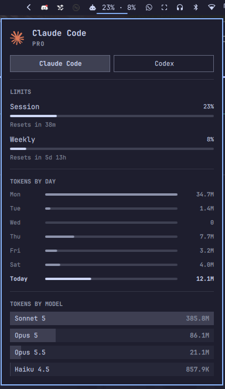
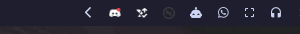
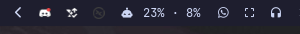

# Agent Usage

Omarchy bar widget that shows your AI coding agent's rate-limit usage right in
the bar. Left-click to toggle between the icon and your default agent's
session · weekly usage. Right-click opens the full dashboard: limits, tokens
by day and tokens by model for every configured agent (Claude Code, Codex,
Fireworks).



It is a fork of Omarchy's built-in `omarchy.agents` widget. The dashboard and
data layer are unchanged. What's new is the inline usage view and the click
layout.

| Icon view | Usage view (session · weekly) |
|---|---|
|  |  |

## Requirements

- Omarchy with the built-in Agents widget (tested on 4.0.4). The widget
  reads the usage records written by Omarchy's own `omarchy-agent-usage-update` and its per-agent collectors
  (`omarchy-agent-usage-claude`, `-codex`, `-fireworks`).
- At least one agent that has been used on this machine. Limits for Claude
  Code need a signed-in `claude` CLI. Without one, the dashboard falls back to
  local token stats and says so.

## Installation

```bash
omarchy plugin add https://github.com/RektyRowdyy/omarchy-agent-usage.git --enable
```

This clones the plugin, validates it, and prompts for a bar section,
defaulting to `right`.

This widget replaces the built-in one, so disable that to avoid two icons (and
two refresh timers):

```bash
omarchy plugin disable omarchy.agents
```

To place the widget somewhere else, or to enable it later:

```bash
omarchy plugin enable io.github.rektyrowdyy.agent-usage --section <left|center|right>
```

## Usage

| Input | Action |
|---|---|
| Left click | Toggle the bar between the icon and inline usage |
| Right click | Open or close the full usage dashboard |
| Middle click | Launch an agent (`omarchy-agent --pick`) |
| Scroll | Switch agent in the dashboard |

- Your icon/usage choice is saved, so it survives a shell restart.
- Hover the inline usage to see every limit with its reset countdown.
- The widget turns the urgent color once any limit reaches 90%.
- On a vertical bar the widget always shows just the icon, because the text
  doesn't fit.
- Agents on a prepaid balance (Fireworks) show the remaining credit inline
  instead of percentages.

Inside the dashboard:
- `h`/`l` switch agent and `j`/`k` scroll.
- `r` or Enter refreshes.
- Tab moves to the neighboring bar panel and Esc closes.

The widget hides itself entirely until some agent has recorded usage.

### IPC

```bash
omarchy-shell io.github.rektyrowdyy.agent-usage <open|close|toggle|refresh|next|cycleView>
omarchy-shell io.github.rektyrowdyy.agent-usage setView usage   # or icon
```

## Configuration

Settings are stored in the widget's entry in `~/.config/omarchy/shell.json`,
and can be changed from Omarchy's bar settings or with `omarchy bar set`:

| Key | Default | What it does |
|---|---|---|
| `barView` | `"icon"` | `"icon"` or `"usage"`. Left-click toggles it |
| `barAgent` | `"claude"` | Which agent's usage appears inline (`claude`, `codex`, `fireworks`). Falls back to the first agent with data |
| `refreshIntervalSec` | `900` | How often the usage records regenerate |
| `providers` | all enabled | Per-agent `{ "enabled": false }` hides a subscription |
| `syncMode` | `"Off"` | `"On"` writes this machine's snapshot to `syncDir` and merges snapshots from other machines |
| `syncDir` | `""` | A folder synced by Syncthing, Dropbox, rsync, … |
| `syncFileName` | `<hostname>.json` | This machine's snapshot file name |
| `syncDeviceId` | hostname | Stable device name inside the snapshot |

```bash
omarchy bar set io.github.rektyrowdyy.agent-usage barAgent codex
omarchy bar set io.github.rektyrowdyy.agent-usage refreshIntervalSec 300 --json
omarchy bar set io.github.rektyrowdyy.agent-usage providers '{"claude":{"enabled":true},"codex":{"enabled":false},"fireworks":{"enabled":false}}' --json
```

Numbers and objects need `--json`, or they are stored as strings.

## Permissions and dependencies

Omarchy plugins run **unsandboxed inside the long-lived `omarchy-shell`
process**, with your own user's permissions. What this one does with them:

- **Collecting usage.** On its refresh timer, when the dashboard opens, and
  when you switch to the usage view, it runs `omarchy-agent-usage-update`,
  which is part of Omarchy, not this plugin. That command:
  - runs Omarchy's per-agent collectors;
  - writes one JSON record per agent into `~/.local/state/omarchy/agents/usage/`;
  - reads local agent history (`~/.claude/projects`, Codex session files,
    opencode/pi sessions);
  - makes network requests with your existing credentials. For Claude it
    calls `https://api.anthropic.com/api/oauth/usage` using the OAuth token in
    `~/.claude/.credentials.json`. For Fireworks it calls
    `https://api.fireworks.ai` using your API key. Codex limits come from the
    local Codex app-server.

  These are exactly the calls the built-in `omarchy.agents` widget already
  makes. The plugin adds no network requests of its own.
- **Reading records.** It lists that directory with `find` and watches the
  records. With `syncMode` on, it reads `/etc/hostname` and reads every
  `*.json` in `syncDir` (via `bash -c` + `cat`).
- **Writing files.** Only when `syncMode` is on: it creates `syncDir`
  (`mkdir -p`) and writes one snapshot file there. That file contains token
  counts, dates and model names, never credentials. Toggling the bar view
  writes `barView` into the widget's own `shell.json` entry.
- **Launching agents.** Middle-click runs `omarchy-agent --pick`, Omarchy's
  agent launcher.
- There is no installer, no remote build step and no second Quickshell process.

## Development

`scripts/dev-install.sh` copies this checkout into
`~/.config/omarchy/plugins/io.github.rektyrowdyy.agent-usage/`, validates it
and rescans plugins. A rescan does not reliably reload QML that is already
compiled, so run `omarchy-restart-shell` after changes before trusting what
you see.

## Removal

```bash
omarchy plugin remove io.github.rektyrowdyy.agent-usage
omarchy plugin enable omarchy.agents   # optional: bring back the built-in widget
```

Removing the plugin also removes its bar entry and all of the settings above
from `shell.json`. It leaves these behind:
- The usage records in `~/.local/state/omarchy/agents/usage/`. They belong to
  Omarchy and are shared with the built-in widget.
- Any snapshot it wrote to your `syncDir`. Delete that yourself if you turned
  sync on.

## Credits

Based on the `omarchy.agents` plugin from
[Omarchy](https://github.com/basecamp/omarchy) (MIT). `Main.qml`, `Agent.qml`
and the agent marks in `assets/` are unchanged from upstream, and `Panel.qml`
is derived from it. This project is unofficial and not affiliated with
Anthropic, OpenAI, Fireworks AI or Basecamp. Product names and marks belong to
their owners.

## License

MIT. See [LICENSE](LICENSE).
